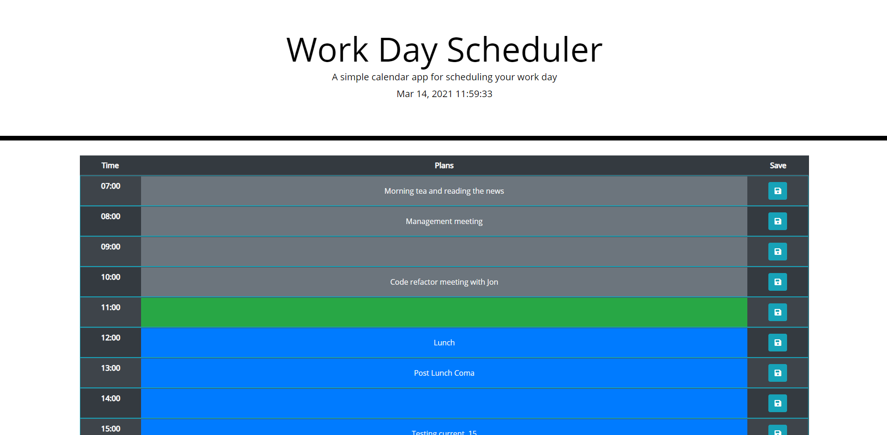

#Work Day Scheduler

This project was to build a day scheduler that was editable and would save your information even if you left the page.

The time at the top of the page updates every second, making sure that you know what the exact time is. The hourly calendar is colored differently for hours that have passed, the current hour, and hours that are still to come. You can click in any of these rows and enter any information, then hit save on the right hand side to have the info save to local storage.

Link to the finished product: https://old-prego.github.io/day-scheduler/

